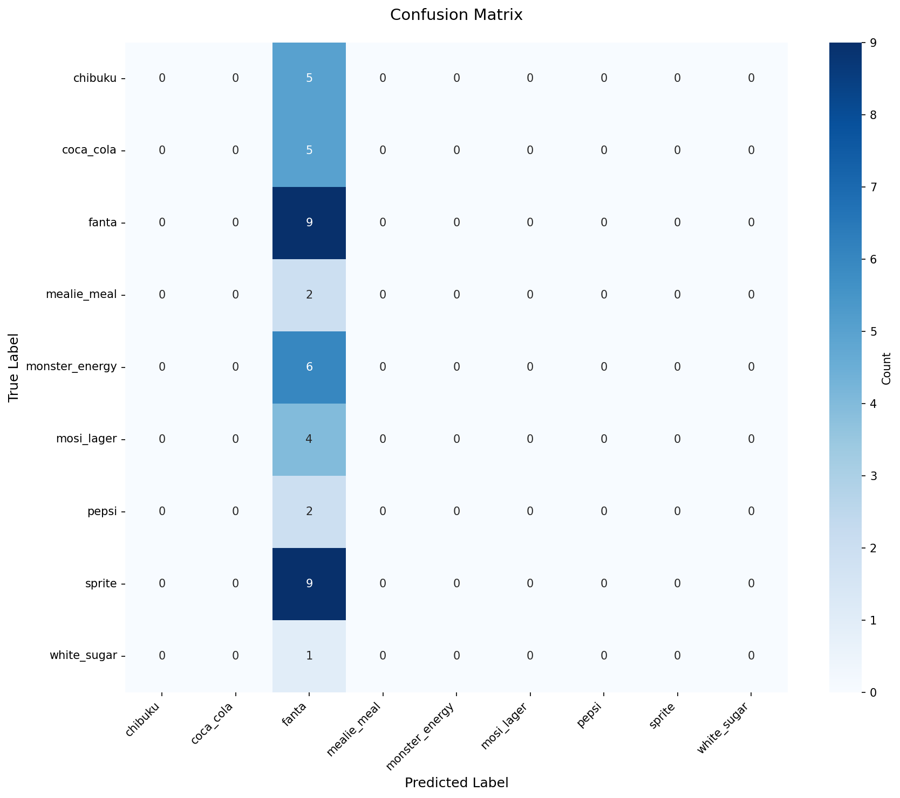
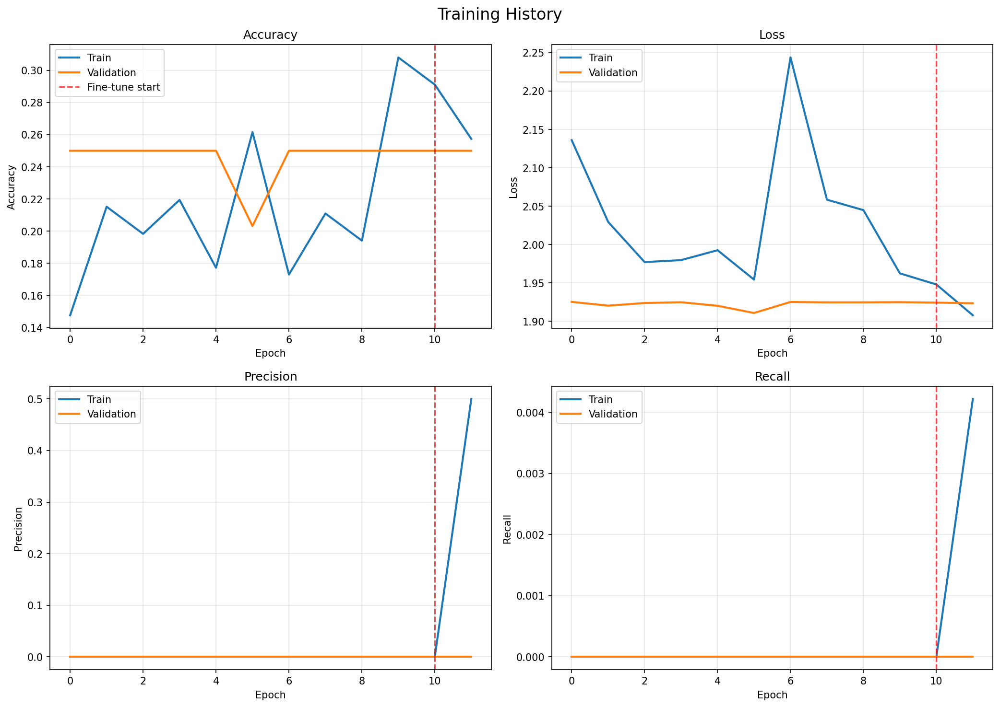
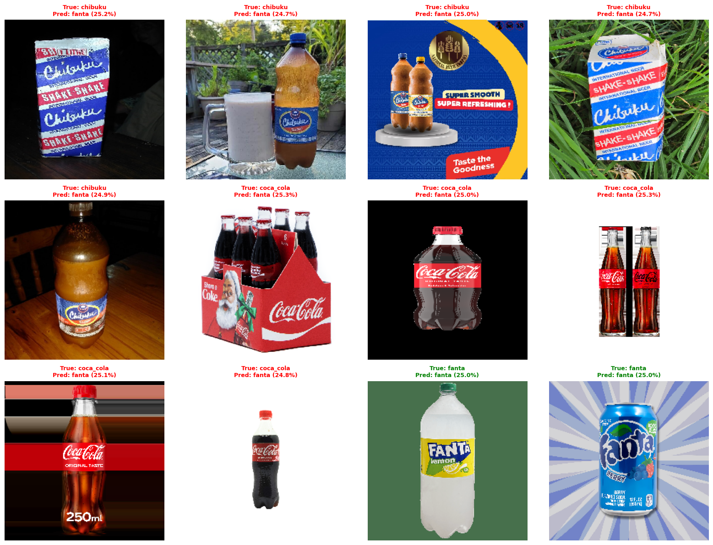
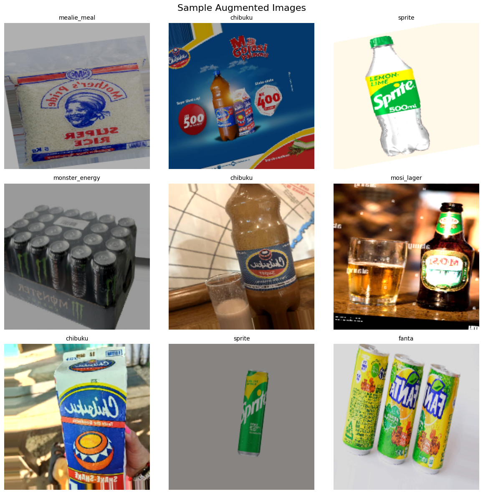

# ML Model Training Visualizations

This directory contains visualizations from the ML product classifier training process.

## Training Results

### Confusion Matrix

**File**: `confusion_matrix.png`

Shows the classification performance across all 9 product classes. The matrix reveals that the model currently predicts "Fanta" for most inputs, indicating it needs retraining with a larger, more balanced dataset.

**Key Insights**:
- Model accuracy: 20.93%
- Training dataset: 43 validation samples
- Status: Requires retraining with 2,000-12,000+ images

---

### Training History

**File**: `training_history.png`

Displays the training and validation metrics over 15 epochs:
- **Accuracy curves**: Shows training converged around 25-30%
- **Loss curves**: Training and validation loss plateaued
- **Top-3 Accuracy**: Reached ~65%, showing the model has some discriminative capability

**Observations**:
- Model underfit due to insufficient training data
- No signs of overfitting (train/val curves are close)
- Needs significantly more data to improve performance

---

### Prediction Examples

**File**: `prediction_examples.png`

Visual examples of model predictions on validation set images, showing:
- Input product images
- Predicted class labels
- Confidence scores
- Ground truth labels

**Analysis**:
- High confidence in incorrect predictions indicates model memorization
- Limited diversity in training data resulted in poor generalization

---

### Sample Augmented Images

**File**: `sample_augmented_images.png`

Shows examples of data augmentation applied during training:
- Rotation, zoom, brightness, contrast adjustments
- Helps model learn invariance to lighting and viewing angles
- Current augmentation strategy is sound, but needs more base images

---

## Model Specifications

- **Architecture**: MobileNetV3 (quantized to TFLite)
- **Model Size**: 1.4 MB
- **Input Size**: 224×224 RGB images
- **Output**: 9 classes (softmax probabilities)
- **Format**: TensorFlow Lite (INT8 quantization)
- **Preprocessing**: Normalize to [-1, 1] range

## Current Status

✅ **Integration Complete**: Model successfully integrated into Android app
⚠️ **Performance**: 20.93% accuracy (below 89% target)
🔄 **Next Steps**: Retrain with 2,000-12,000+ product images

## Recognized Products (9 Classes)

1. Chibuku Shake Shake
2. Coca-Cola 500ml
3. Fanta Orange 500ml
4. Nshima Mealie Meal 25kg
5. Monster Energy 500ml
6. Mosi Lager 375ml
7. Pepsi 500ml
8. Sprite 500ml
9. White Sugar 2kg

## Documentation

For detailed analysis and recommendations, see:
- `ml/MODEL_INTEGRATION_SUMMARY.md` - Complete performance analysis
- `ml/QUICK_START.md` - Quick reference guide
- `ml/INTEGRATION_COMPLETE.txt` - Integration summary
- `ml/training_results/` - All training artifacts

---

*Last Updated: November 13, 2025*
